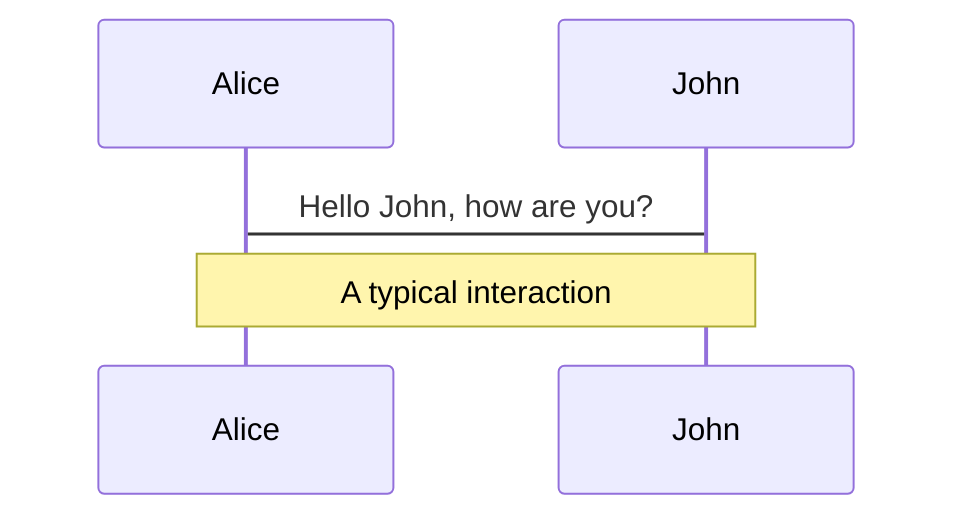
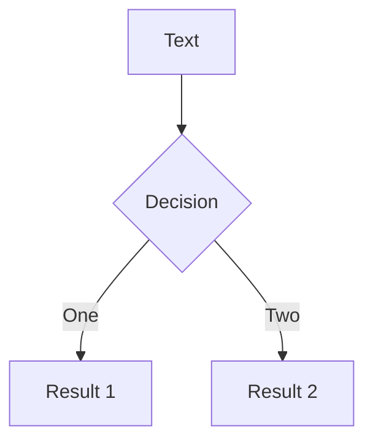
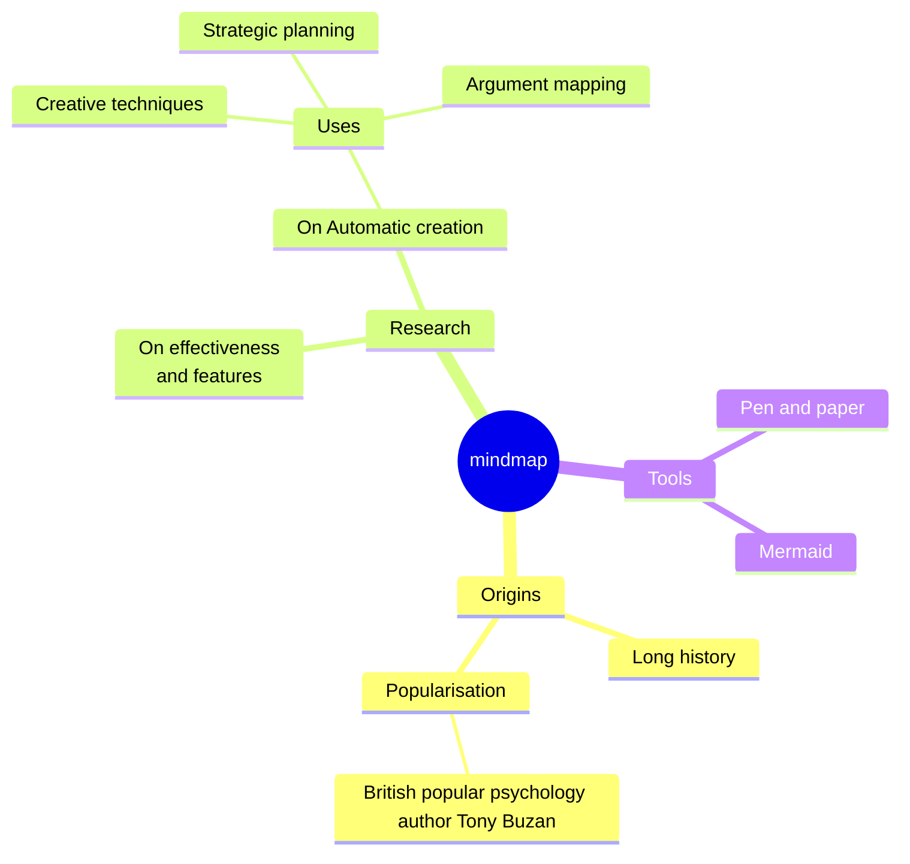
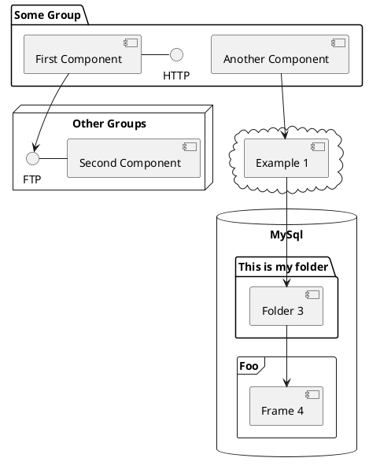

# Welcome to Slidev

Presentation slides for developers

<div class="pt-12">
  <span @click="$slidev.nav.next" class="-ml-2 px-2 py-1 rounded cursor-pointer" hover="bg-white bg-opacity-10">
    Press Space for next page <carbon:arrow-right class="inline"/>
  </span>
</div>

<!--
最後のコメントブロックはスライドノートとして扱われます。プレゼンターモードでスライドと一緒に表示され、編集も可能です。

詳細: [https://sli.dev/guide/syntax.html#notes](https://sli.dev/guide/syntax.html#notes)
-->

---
transition: fade-out
---

# Slidevって何?

Slidevは開発者向けのスライド作成・プレゼンツールです。

- 📝 **テキストベース**でスライドを作成し、後からスタイリングを行うことができる
- 🎨 **テーマ**を共有・再利用できるnpmパッケージとして提供されている
- 🧑‍💻 **開発者向け**に作られており、コードハイライトやオートコンプリート機能を備えている
- 🤹 **インタラクティブ**なスライドを作成でき、Vueコンポーネントを埋め込むことができる
- 🎥 **録画**機能を備えており、カメラビューも利用できる
- 📤 **ポータブル**なスライドを作成でき、PDF、PPTX、PNG、ホスト可能なSPAなどにエクスポートできる
- 🛠 **拡張性**が高く、Webページで可能なことなら何でも実現可能

<br>

[Why Slidev? (英語)](https://sli.dev/guide/why)

<!--
styleタグを使ってページごとにスタイルを上書きすることができます。
詳細: https://sli.dev/features/slide-scope-style
-->

<style>
h1 {
  background-color: #2B90B6;
  background-image: linear-gradient(45deg, #4EC5D4 10%, #146b8c 20%);
  background-size: 100%;
  -webkit-background-clip: text;
  -moz-background-clip: text;
  -webkit-text-fill-color: transparent;
  -moz-text-fill-color: transparent;
}
</style>

---
transition: slide-up
level: 2
---

# ナビゲーション

左下にカーソルを持っていくと、ナビゲーションパネルが表示されます。

詳細: [Navigation Bar](https://sli.dev/guide/ui#navigation-bar)

## キーボードショートカット

|                                                    |                                  |
| -------------------------------------------------- | -------------------------------- |
| <kbd>right</kbd> / <kbd>space</kbd>                | 次のアニメーション・ページに送る |
| <kbd>left</kbd> / <kbd>shift</kbd><kbd>space</kbd> | 前のアニメーション・ページに戻る |
| <kbd>up</kbd>                                      | 次のページ                       |
| <kbd>down</kbd>                                    | 前のページ                       |

<!--
https://sli.dev/guide/animations.html#click-animation
-->

---
layout: two-cols
layoutClass: gap-16
---

# 目次

`Toc`コンポーネントを使って、スライドの目次を生成できます。

```html
<Toc minDepth="1" maxDepth="1"></Toc>
```

タイトルはスライドの内容から推測されますが、frontmatterの`title`と`level`で上書きもできます。

::right::

<Toc v-click minDepth="1" maxDepth="2" class="text-sm"></Toc>

---

# コード

コードスニペットを使って、ハイライトや型のホバー表示が可能です。

```ts {all|5|7|7-8|10|all} twoslash
// TwoSlashは、markdownのコードブロックで
// TypeScriptのホバー情報やエラーを有効にします
// 詳細は https://shiki.style/packages/twoslash

import { computed, ref } from "vue";

const count = ref(0);
const doubled = computed(() => count.value * 2);

doubled.value = 2;
```

<arrow v-click="[4, 5]" x1="350" y1="290" x2="195" y2="304" color="#953" width="2" arrowSize="1" />

<!-- 外部ファイルをコードブロックとして埋め込むこともできます -->

<!-- <<< @/snippets/external.ts#snippet -->

<!-- Footer -->
<div class="text-right">

詳細: [Line Highlighting](https://sli.dev/features/line-highlighting)

</div>

<!-- Inline style -->
<style>
.footnotes-sep {
  @apply mt-5 opacity-10;
}
.footnotes {
  @apply text-sm opacity-75;
}
.footnote-backref {
  display: none;
}
</style>

<!--
スライドノートはクリックと同期できます

[click] 最初のクリック後にハイライトされます

[click] `count = ref(0)` と一緒にハイライトされます

[click:3] 2回のクリックをスキップして、最後のクリックです
-->

---
level: 2
---

# Shiki Magic Move

[shiki-magic-move](https://shiki-magic-move.netlify.app/) によって、複数のコードスニペット間でのアニメーションが可能です。

<!-- 4つ連続の`がprettierに消されるためignore -->
<!-- prettier-ignore -->
<pre class="inline"><code>````md magic-move````</code></pre> (4つのバックティック)

で囲んだ複数のコードブロックを追加すると、マジックムーブが有効になります。

````md magic-move {lines: true}
```ts {*|2|*}
// step 1
const author = reactive({
  name: "John Doe",
  books: [
    "Vue 2 - Advanced Guide",
    "Vue 3 - Basic Guide",
    "Vue 4 - The Mystery",
  ],
});
```

```ts {*|1-2|3-4|3-4,8}
// step 2
export default {
  data() {
    return {
      author: {
        name: "John Doe",
        books: [
          "Vue 2 - Advanced Guide",
          "Vue 3 - Basic Guide",
          "Vue 4 - The Mystery",
        ],
      },
    };
  },
};
```

```ts
// step 3
export default {
  data: () => ({
    author: {
      name: "John Doe",
      books: [
        "Vue 2 - Advanced Guide",
        "Vue 3 - Basic Guide",
        "Vue 4 - The Mystery",
      ],
    },
  }),
};
```

コードブロック以外の部分は無視されます

```vue
<!-- step 4 -->
<script setup>
const author = {
  name: "John Doe",
  books: [
    "Vue 2 - Advanced Guide",
    "Vue 3 - Basic Guide",
    "Vue 4 - The Mystery",
  ],
};
</script>
```
````

---

# コンポーネント

<div grid="~ cols-2 gap-4">
<div>

Vueコンポーネントを直接スライド内で使用できます。

ビルトインコンポーネントとして、`<Tweet/>`と`<Youtube/>`が提供されています。また、独自のコンポーネントを追加することも簡単です。

```html
<Counter :count="10" />
```

<!-- ./components/Counter.vue -->
<Counter :count="10" m="t-4" />

コンポーネントの制作は[ガイド](https://sli.dev/builtin/components.html)を参照してください。

</div>
<div>

```html
<Tweet id="1390115482657726468" />
```

<Tweet id="1390115482657726468" scale="0.65" />

</div>
</div>

<!--
スライドノートは **太字**、*斜体*、~~取り消し線~~ に対応しています。

HTMLも使えます:
<div class="flex w-full">
  <span style="flex-grow: 1;">ひだり</span>
  <span>みぎ</span>
</div>
-->

---

# クリックアニメーション

`v-click`を要素に追加すると、クリックアニメーションが追加されます。

<div v-click>

ここはスライドをクリックすると表示されます。

```html
<div v-click>ここはスライドをクリックすると表示されます。</div>
```

</div>

<br>

<v-click>

<span v-mark.red="3"><code>v-mark</code> ディレクティブ</span>を使うと、 [Rough Notation](https://roughnotation.com/) による<span v-mark.circle.orange="4">インラインマーカー</span>を追加できます。

```html
<span v-mark.underline.orange>インラインマーカー</span>
```

</v-click>

<div mt-20 v-click>

詳細: [Click Animation](https://sli.dev/guide/animations#click-animation)

</div>

---

# モーション

[@vueuse/motion](https://motion.vueuse.org/)によるモーションアニメーションを、`v-motion`ディレクティブで追加できます。

```html
<div
  v-motion
  :initial="{ x: -80 }"
  :enter="{ x: 0 }"
  :click-3="{ x: 80 }"
  :leave="{ x: 1000 }"
>
  Slidev
</div>
```

<div class="w-60 relative">
  <div class="relative w-40 h-40">
    
    
    
  </div>

  <div
    class="text-5xl absolute top-14 left-40 text-[#2B90B6] -z-1"
    v-motion
    :initial="{ x: -80, opacity: 0}"
    :enter="{ x: 0, opacity: 1, transition: { delay: 2000, duration: 1000 } }">
    Slidev
  </div>
</div>

<!-- vue script setup scripts can be directly used in markdown, and will only affects current page -->
<script setup lang="ts">
const final = {
  x: 0,
  y: 0,
  rotate: 0,
  scale: 1,
  transition: {
    type: 'spring',
    damping: 10,
    stiffness: 20,
    mass: 2
  }
}
</script>

<div
  v-motion
  :initial="{ x:35, y: 30, opacity: 0}"
  :enter="{ y: 0, opacity: 1, transition: { delay: 3500 } }">

詳細: [Motion](https://sli.dev/guide/animations.html#motion)

</div>

---

# LaTeX

セットアップ不要で[KaTeX](https://katex.org/) によるLaTeX表示を使えます。

<div h-3 />

<!-- textlint-disable -->

インライン $\sqrt{3x-1}+(1+x)^2$

ブロック

$$
{1|3|all}
\begin{aligned}
\nabla \cdot \vec{E} &= \frac{\rho}{\varepsilon_0} \\
\nabla \cdot \vec{B} &= 0 \\
\nabla \times \vec{E} &= -\frac{\partial\vec{B}}{\partial t} \\
\nabla \times \vec{B} &= \mu_0\vec{J} + \mu_0\varepsilon_0\frac{\partial\vec{E}}{\partial t}
\end{aligned}
$$

<!-- textlint-enable -->

詳細: [LaTeX](https://sli.dev/features/latex)

---

# Mermaid & PlantUML

Markdownで直接記述したMermaid, PlantUMLテキストから、図やグラフを作成できます。

<div class="grid grid-cols-4 gap-5 pt-4 -mb-6">









</div>

詳細: [Mermaid Diagrams](https://sli.dev/features/mermaid), [PlantUML Diagrams](https://sli.dev/features/plantuml)

---
foo: bar
dragPos:
  square: 691,32,167,_,-16
---

# Draggable Elements

ダブルクリックしてドラッグできる要素を作成できます。

<br>

###### ディレクティブによる使用

```md

```

<br>

###### コンポーネントによる使用

```md
<v-drag text-3xl>
  <carbon:arrow-up />
  Use the `v-drag` component to have a draggable container!
</v-drag>
```

<!-- prettier-ignore -->
<v-drag pos="663,206,261,_,-15">

  <div text-center text-3xl border border-main rounded>
    ダブルクリック!
  </div>
</v-drag>


###### ドラッグできる矢印

```md
<v-drag-arrow two-way />
```

<v-drag-arrow pos="67,452,253,46" two-way op70 />

---
src: ./pages/imported-slides.md
hide: false
---

---
# 次のページをトランジションなしで表示
transition: none
---

# Monaco Editor

SlidevにはMonaco Editorが組み込まれています。

`{monaco}`をコードブロックに追加すると、エディターに変換されます。

```ts {monaco}
import { ref } from "vue";
import { emptyArray } from "./external";

const arr = ref(emptyArray(10));
```

---
title: Monaco Run
level: 2
---

# Monaco Editor

`{monaco-run}`を使うと、スライド内で直接コードを実行できるエディターが作成されます。

```ts {monaco-run}
import { version } from "vue";
import { emptyArray, sayHello } from "./external";

sayHello();
console.log(`vue ${version}`);
console.log(
  emptyArray<number>(10).reduce(
    (fib) => [...fib, fib.at(-1)! + fib.at(-2)!],
    [1, 1],
  ),
);
```

---
layout: center
class: text-center
---

# Learn More

[Documentation](https://sli.dev) · [GitHub](https://github.com/slidevjs/slidev) · [Showcases](https://sli.dev/resources/showcases)

<PoweredBySlidev mt-10 />

---

# layoutの使用例

- デフォルト
  - two-cols
- slidev-theme-ncdcで更新したlayout
  - cover
  - end
- slidev-theme-ncdcで追加されたlayout
  - screenshot-top
  - screenshot-bottom

---
level: 2
layout: two-cols
---

# two-cols

よく使いそうな2カラムレイアウトです。

::right::

# &nbsp;

`::right::`以降に記述された内容は右側に表示されます。

```markdown
---
layout: two-cols
---

# two-cols

よく使いそうな2カラムレイアウトです。

::right::

# &nbsp;

`::right::`以降に記述された内容は右側に表示されます。
```

---
level: 2
layout: cover
---

# cover

NCDCのプレゼンテーションスタイルのcoverレイアウトです。

---
level: 2
layout: screenshot-top
image: /sli.dev.png
---

# screenshot-top

スクリーンショットとコメントを上下に配置できるレイアウトです。

画像は`public/`下に配置し、 `/image.png` のように指定します。

---
level: 2
layout: screenshot-bottom
image: /sli.dev.png
---

# screenshot-bottom

スクリーンショットとコメントを上下に配置できるレイアウトです。

---
level: 2
layout: end
---
